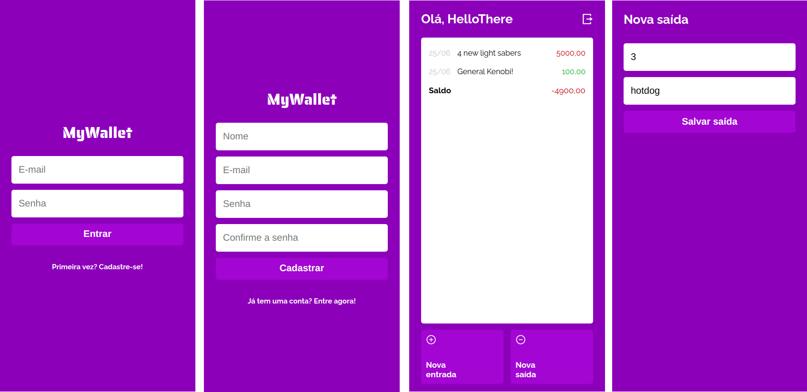

# My Wallet - frontend

My Wallet is a log-book web app for earnings and expenditures. Users can sign up and keep track of their finances using a simple interface. This is the repo for the frontend side of the app. You can check out the backend repo [here](https://github.com/vitorelourenco/my-wallet-back)

## Built With

- React , JavaScript , CSS3 , HTML5  
- Windows, Linux

## Instalation
- Install Node.js and git
- git clone https://github.com/vitorelourenco/my-wallet-front
- npm install

## Preview
- $ npm start 

## Build
- $ npm run build

## Dependencies
- All dependencies are listed in the package.json file.

## Deploy
- You can deploy this project on vercel.com by pushing it to github and linking Vercel to it

## Author

👤 **Vitor Emanuel Lourenco**

- GitHub: [@vitorelourenco](https://github.com/vitorelourenco)
- Twitter: [@Vitorel](https://twitter.com/Vitorel)
- LinkedIn: [vitoremanuellourenco](https://www.linkedin.com/in/vitoremanuellourenco/)

## 🤝 Contributing

Contributions, issues, and feature requests are welcome!

Feel free to check the [issues page](https://github.com/vitorelourenco/my-wallet-front/issues).

## Show your support

Give a ⭐️ if you like this project!

## Acknowledgments

- RespondeAi (https://www.respondeai.com.br/)
- The Odin Project (https://www.theodinproject.com/)
